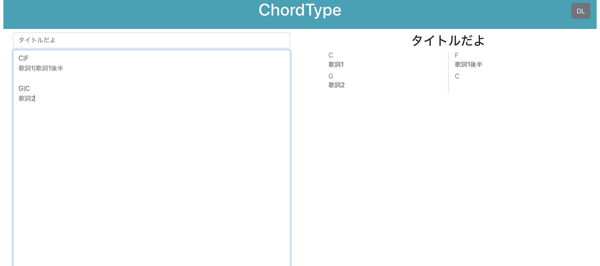

# ChordType

コード譜作成支援Webアプリ

## How To

ChordTypeはコード譜（歌詞の上にコードネームが乗ったもの）作成支援のためのWebアプリです。

画面左のテキストボックスに一定の記法で文章を打つことで、画面右にコード譜が表示されます。

表示されたコード譜は「DL」ボタンからダウンロードできます（PNG形式）。

料金などはかかりません。

## Syntax

### 分割

ChordTypeでは空行（改行コード2つ）を区切りとして文章を分割しています。

分割された一つ一つのブロックごとに、1行目にコード、2行目に歌詞を書きます。

コードと歌詞はそれぞれ `|` で分割することができます。

分割された1小節ぶんのコード/歌詞を、さらに `,` で分割できます。

分割されたコード/歌詞は左辺が揃うため、コードの変わり目と歌詞を合わせるように使えます。

#### 分割イメージ

- 歌詞全体
  - ブロック（改行コード2つで分割）
    - コード（1行目）
      - 小節（`|`で分割）
        - 歌詞断片（`,`で分割）
        - 歌詞断片（`,`で分割）
      - 小節（`|`で分割）
        - 歌詞断片（`,`で分割）
        - 歌詞断片（`,`で分割）
    - 歌詞（2行目）
      - 小節（`|`で分割）
        - 歌詞断片（`,`で分割）
        - 歌詞断片（`,`で分割）
      - 小節（`|`で分割）
        - 歌詞断片（`,`で分割）
        - 歌詞断片（`,`で分割）
- ブロック（改行コード2つで分割）
    - コード（1行目）
      - 小節（`|`で分割）
        - 歌詞断片（`,`で分割）
        - 歌詞断片（`,`で分割）
      - 小節（`|`で分割）
        - 歌詞断片（`,`で分割）
        - 歌詞断片（`,`で分割）
    - 歌詞（2行目）
      - 小節（`|`で分割）
        - 歌詞断片（`,`で分割）
        - 歌詞断片（`,`で分割）
      - 小節（`|`で分割）
        - 歌詞断片（`,`で分割）
        - 歌詞断片（`,`で分割）

### その他

`[A]`のような、`[`でくくった英数字を行頭に入れることで太字表記します（Aメロやサビなどに使用する想定）。

`---`を行頭に入れることで区切り線を表示します。

